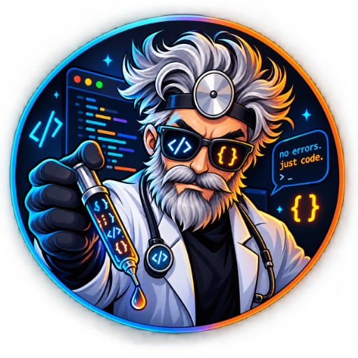

<p align="center">
  
</p>

<h1 align="center">Dr. Syntax</h1>

<p align="center">
  A theme family for <a href="https://zed.dev">Zed</a>, in three variants:
  <strong>Dark</strong>, <strong>OLED</strong> and <strong>Light</strong>.
</p>

<p align="center">
  <a href="https://chrisnicholson30.github.io/Dr.-Syntax/"><strong>See it running →</strong></a>
</p>

Built for Zed specifically — **every one of the 185 colour keys** the Zed theme schema accepts,
plus 62 syntax keys, per variant. That includes the Vim and Helix mode indicators, editor diff
hunks, minimap, indent guides, debugger and collaboration cursors — not just the handful of keys
a ported TextMate theme fills in.

For reference, Zed's own bundled One theme sets 139 of the 185.

| Variant | Background | Syntax plane | Minimum contrast |
|---|---|---|---|
| Dr. Syntax Dark | `#13161d` | OKLCH L 0.737 | **7.16:1** |
| Dr. Syntax OLED | `#000000` | OKLCH L 0.799 | **10.53:1** |
| Dr. Syntax Light | `#f9fbff` | OKLCH L 0.439 | **7.14:1** |

Every syntax colour in every variant clears **WCAG AAA (7:1)** against its editor background.
That is a measured claim, not a marketing one: `tools/build_theme.py` fails the build if any
colour misses its floor, and the numbers are printed on every run.

---

## Install

**As a dev extension (now)**

```
git clone https://github.com/chrisnicholson30/dr.-syntax
```

In Zed: `cmd-shift-p` → **zed: install dev extension** → choose the cloned directory.
Then `cmd-shift-p` → **theme selector: toggle** → pick *Dr. Syntax Dark*, *OLED* or *Light*.

**From the extension store**

`cmd-shift-p` → **zed: extensions** → search *Dr. Syntax*. (Pending submission.)

---

## The idea

Most themes are a list of hex codes chosen by eye. That produces two problems you feel rather
than see.

**1. Colours that are nominally equal are not perceptually equal.** Two hex values with the same
apparent brightness can differ by 30–40% in perceived lightness depending on hue — human vision
is far more sensitive to green than to blue. So a "green" and a "blue" picked to match will not
match, and your eye re-adapts every time it crosses one. Over an eight-hour day that is fatigue
you cannot point at.

Dr. Syntax is authored in **OKLCH**, a perceptually uniform colour space. Every syntax token in a
variant sits on **one shared lightness plane**. Nothing glows brighter than its neighbours.

**2. Contrast is usually assumed rather than checked.** Here the design states an intent —
*"comments sit at 5.8:1, present but recessive"* — and the lightness is solved by binary search to
land on it. Colours are derived from the requirement, not measured after the fact and hoped for.

The generator is the single source of truth. `themes/dr-syntax.json` is build output.

### The lightness plane is solved, not chosen

sRGB chroma varies sharply and non-obviously with lightness, so the plane that yields the most
vivid palette is rarely where intuition puts it. The build searches for the lightness that
**maximises mean achievable chroma across all eight hues, subject to every hue clearing the
contrast floor.**

For the dark variant this returned L=0.737. The value picked by eye first was 0.82 — which cost
about 15% chroma for contrast headroom nothing needed.

### Plain code sits on the same plane

Usually a theme's foreground is much brighter than its syntax colours. The effect is that colour
reads as *less* important than plain text, and structure recedes exactly where it should pop.
Here `editor.foreground` is derived from the syntax plane and sits just above it, so colour
distinguishes **role**, not importance.

### Colour is spent on structure

Most of a file is near-neutral by design. Variables, parameters and punctuation stay close to the
foreground; colour is reserved for the things you actually scan for. Definitions —
`function.definition`, `constructor`, `title` — are **bold**, so you can find where something is
declared without reading the file.

### Mode indicators are judged against themselves

A Vim mode chip carries its own label, so the contract is the label against the chip rather than
against the editor. Each of the eight mode colours gets a neutral solved to 7:1 on its own
background — dark labels on the bright chips of a dark variant, light labels on the deep chips of
the light one. Diff hunk fills and the yank flash sit *behind* code, so they take the overlay
contract below instead.

### Selections are solved too, not eyeballed

A selection is drawn *under* your code. Push its opacity up so you can see what you have selected
and the text on top loses contrast — which is why, in a great many themes, comments disappear the
moment you select a block. Both requirements are real and they pull against each other, so the
opacity is solved rather than picked: the **strongest** overlay that still leaves every token
readable, on both the plain background and the active line, searched on the 8-bit alpha grid the
theme file actually stores.

That gives a two-level contract:

| State | Floor | Rationale |
|---|---|---|
| Sustained reading, plain background | **7:1** syntax, 5.8:1 comments | WCAG AAA body text |
| Transient — selection, search match | **3.5:1** every token | Above WCAG's 3:1 non-text threshold |

`tools/validate_theme.py` measures 1,364 token-on-overlay combinations per variant — 4,092 across
the family. The worst lands at 3.51:1, right on the floor, which is the point: the solver returns
the most visible selection the contract permits, not a cautious one.

Inlay hints are held to 6:1 for the same reason. Sitting them just above 4.5 — the usual choice —
drags the viable selection opacity down to the point of invisibility.

---

## The palette grammar

Eight hues, spaced around the wheel so no two adjacent token classes are perceptually adjacent.
The build asserts a minimum Oklab separation of 0.050 between any two; the tightest actual gap
is 0.078.

| Role | Hue | Dark | Light |
|---|---|---|---|
| keyword, control flow, storage | rose | `#f678b9` | `#920069` |
| tag, namespace, markup title | orchid | `#d684ee` | `#74209b` |
| attribute, preprocessor, UI accent | violet | `#9d9eff` | `#4538b6` |
| property, member, label | azure | `#35b5ff` | `#005397` |
| function, method | cyan | `#00c1c9` | `#005f61` |
| string, literal text | jade | `#10c97f` | `#00641c` |
| type, class, enum | amber | `#d5a100` | `#813c00` |
| number, boolean, constant | tangerine | `#ff8243` | `#9d0020` |

### Why the three variants are not one variant inverted

**OLED** is not "dark with the background set to black". Three changes matter. Chroma is pulled
back, because high-chroma text on true black blooms on emissive panels — an artefact of the
display, not the palette. The contrast floor is *raised* to 10.5:1, because against `#000` even a
murky colour clears 7:1, so the AAA floor stops being a useful constraint and would happily return
something dim. And overlay surfaces are defined by their distance from the background rather than
by a lightness offset — an offset collapses to nothing at `#000`, which is what makes the active
line and the active tab indicator invisible in most OLED themes. Panels and popovers lift off pure
black so the UI keeps its depth while the editor stays fully unlit.

**Light** rotates its hues. At the lightness a light theme needs in order to clear AAA, two
regions of the sRGB gamut collapse: 60–120° (yellow) and 165–240° (teal) can only hold ~0.08–0.10
chroma, which renders as mud. This is measured in `docs/PALETTE.md`, and it is why so many light
themes look washed out — a naive inversion drops tokens straight into those dead zones. The light
variant sites its hues outside them, which recovers 13% mean chroma and 47% hue separation.

One honest limit: `function` on Light is a deep teal at chroma 0.075 — the strongest colour that
hue region can hold at 7:1. Reaching a vivid cyan there would mean dropping to roughly 4.5:1.
The floor was kept and the chroma given up.

---

## Verify it yourself

```
python3 tools/build_theme.py           # regenerate; fails if any contrast floor is missed
python3 tools/build_theme.py --check   # verify only, writes nothing
python3 tools/validate_theme.py        # structural + key-coverage validation
```

`build_theme.py` runs 44 contrast assertions per variant and checks perceptual separation, and
refuses to write the theme if any fail.

`validate_theme.py` checks the shipped JSON independently of the generator, so a bug in
`build_theme.py` cannot vouch for its own output. It verifies structure and colour format, key
coverage, and re-derives all 4,092 overlay contrast measurements from the JSON alone. Both scripts
exit non-zero on failure and need nothing beyond the Python standard library.

Coverage is checked against `tools/required_keys.json` — every non-deprecated `#[serde(rename)]`
in Zed's own `ThemeColorsContent` and `StatusColorsContent`. An earlier version of this repo
baselined against the One theme's key set instead, which silently passed a theme missing 25 keys,
because One does not set them either. A baseline has to be the schema, not another theme.

Full per-colour measurements are in [`docs/PALETTE.md`](docs/PALETTE.md).

```
python3 tools/build_preview.py         # regenerate docs/index.html
```

[`docs/index.html`](docs/index.html) is the project page, published at
**[chrisnicholson30.github.io/Dr.-Syntax](https://chrisnicholson30.github.io/Dr.-Syntax/)**: all
three variants rendered in a mock editor on real TypeScript, the measured hue table, and a chart
of reachable chroma by hue showing the light-gamut dead zones. Colours are read out of
`themes/dr-syntax.json`, so the page cannot drift from what ships.

The site deploys from `.github/workflows/pages.yml`, which runs both verification scripts first —
a failing contrast assertion fails the deploy.

---

## Licence

MIT — see [LICENSE](LICENSE).
